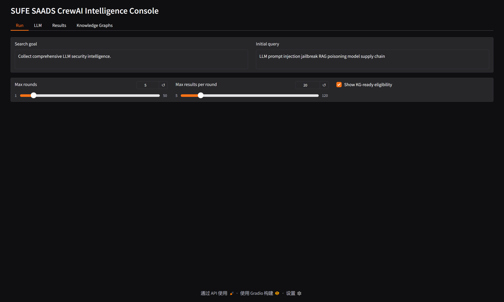
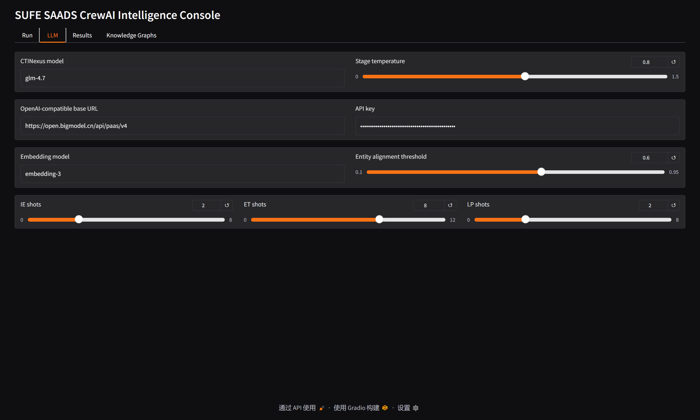
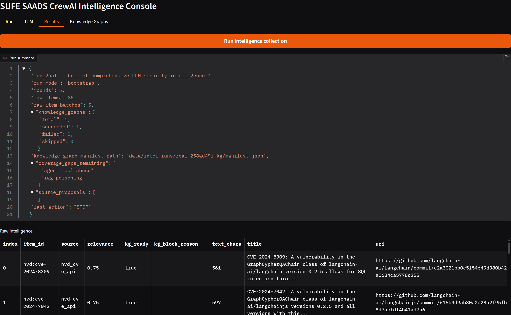
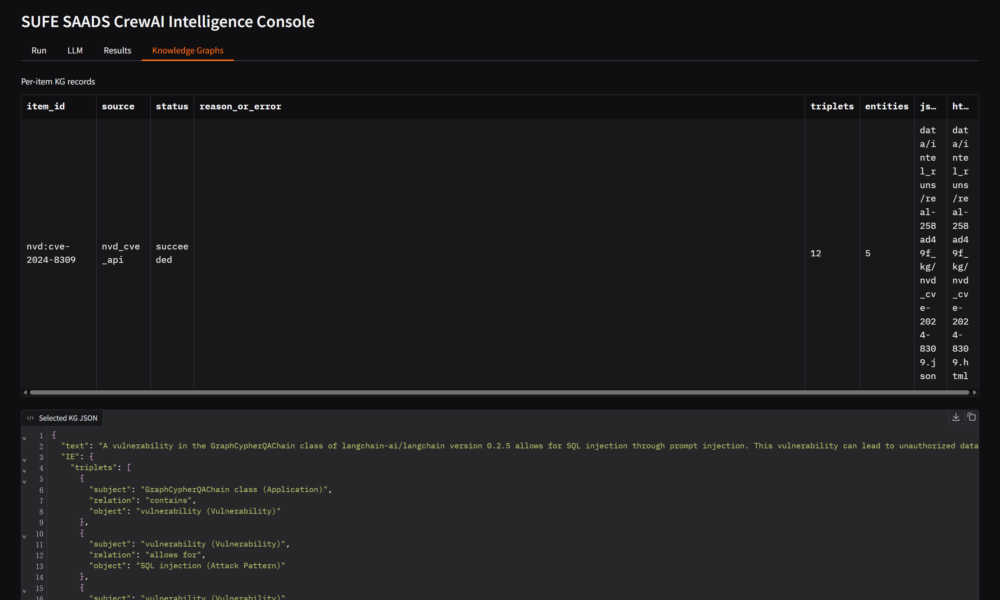
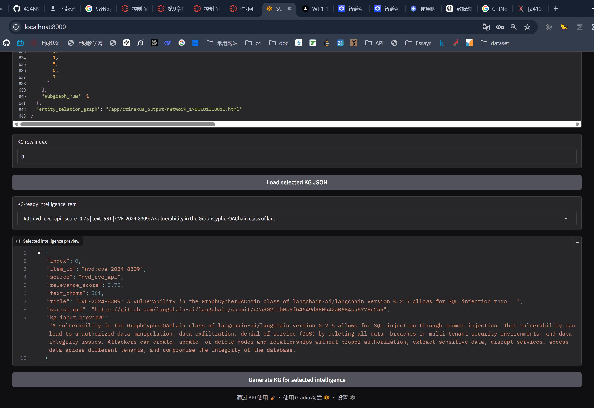
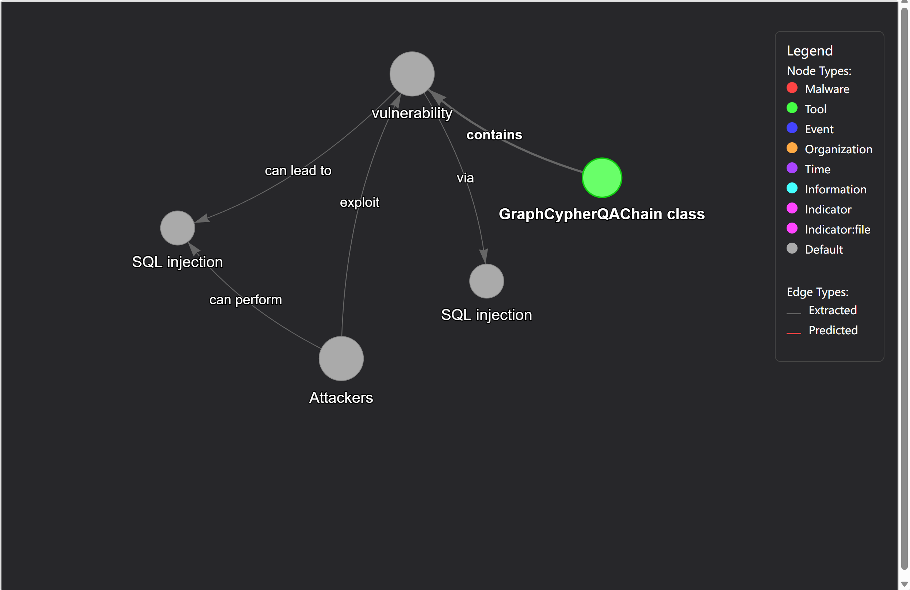

# SUFE-SAADS-CrewAI

SUFE-SAADS-CrewAI 是一个面向大模型安全情报采集与知识图谱生成的智能体项目。当前仓库主要是实现情报自动化采集 + 知识图谱构建。

项目的核心目标是：

- 自动从真实安全数据源中采集与 LLM / AI 安全相关的情报。
- 对采集结果进行相关性判断、覆盖度分析和下一轮检索反思。
- 在 Web 页面中选择高质量情报，并调用 CTINexus 为单条情报生成小型知识图谱。
- 将每次运行的原始情报、检索过程、覆盖缺口、KG 结果持久化为 JSON，方便后续分析和系统集成。

目前项目重点关注真实安全情报，例如 NVD、CISA KEV、OSV 中与 prompt injection、jailbreak、RAG poisoning、agent tool abuse、AI model supply chain 等主题相关的记录。

## 功能概览

### 1. 真实情报采集

采集控制器位于：

```text
src/sufe_saads_crewai/intel/real_loop.py
```

目前支持的主要数据源包括：

- NVD CVE API
- CISA KEV JSON
- OSV.dev API
- arXiv API

系统会围绕搜索目标自动生成 source-specific query，并记录每一轮检索的：

- query text
- 使用的数据源
- 新增 item
- 重复率
- 低相关度噪声比例
- coverage gaps
- 下一轮检索建议

### 2. 反思与覆盖度判断

一次采集运行不是简单搜索一次就结束。系统会在每轮之后计算和分析：

- 本轮新增情报数量
- novelty score
- duplicate ratio
- noise ratio
- 已覆盖的大模型安全主题
- 仍缺失的 coverage gaps

如果覆盖度不足，系统会围绕缺口改写下一轮查询；如果达到停止条件或没有高收益缺口，就结束运行。

### 3. 单条情报 KG 生成

KG 生成基于 CTINexus (https://doi.org/10.48550/arXiv.2410.21060)：

```text
ctinexus==0.2.1
```

当前逻辑是：

1. 采集完成后，Web 页面会判断每条情报是否 `kg_ready=true`。
2. `Knowledge Graphs` 页面只展示 `kg_ready=true` 的情报。
3. 用户选择一条情报后，系统只把该 item 的 `raw_text` 传给 CTINexus。
4. 如果 `raw_text` 为空，则传 `summary`。
5. 不会把 title、source、URI、metadata、CVE 字段拼进 CTINexus 输入文本。
6. `source_uri` 只保留在本项目记录中用于溯源，不作为 CTINexus 的 `source_url` 传入。

例如某条 item 中真正传给 KG 智能体的是这类文本：

```text
A prompt injection vulnerability in the chatbox of Netangular Technologies ChatNet AI Version v1.0 allows attackers to access and exfiltrate all previous and subsequent chat data between the user and the AI assistant via a crafted message.
```

KG 输出会保存为：

```text
data/intel_runs/<run_id>_kg/<item_id>.json
data/intel_runs/<run_id>_kg/manifest.json
```

如果 CTINexus 生成 HTML 可视化图，也会保存在同一 KG 目录中。

## 技术栈

- Python `>=3.10,<3.14`
- CrewAI `1.14.4`
- CTINexus `0.2.1`
- Gradio `>=5,<6`
- uv
- Docker / Docker Compose
- LiteLLM 兼容模型调用

## 目录结构

```text
.
├── src/sufe_saads_crewai/
│   ├── config/
│   │   ├── agents.yaml
│   │   └── tasks.yaml
│   ├── intel/
│   │   └── real_loop.py
│   ├── kg/
│   │   ├── ctinexus_adapter.py
│   │   ├── eligibility.py
│   │   ├── feedback.py
│   │   └── prompting.py
│   ├── persistence/
│   │   └── intel_run_store.py
│   ├── schemas/
│   ├── tools/
│   ├── web/
│   │   └── app.py
│   ├── crew.py
│   └── main.py
├── data/intel_runs/
├── docs/
├── Dockerfile
├── docker-compose.yml
├── .env.example
└── pyproject.toml
```

## 环境变量

复制示例配置：

```bash
cp .env.example .env
```

Windows PowerShell 可以使用：

```powershell
Copy-Item .env.example .env
```

常用变量如下：

```env
# CrewAI / main LLM
GLM_API_KEY=
GLM_BASE_URL=
OPENAI_API_KEY=
OPENAI_BASE_URL=

# CTINexus KG generation
CTINEXUS_API_KEY=
CTINEXUS_BASE_URL=

# Source APIs
NVD_API_KEY=

# Web UI
GRADIO_SERVER_NAME=0.0.0.0
GRADIO_SERVER_PORT=8000
```

说明：

- 如果 `CTINEXUS_API_KEY` / `CTINEXUS_BASE_URL` 为空，KG 适配层会回退到 `OPENAI_*`，再回退到 `GLM_*`。
- `NVD_API_KEY` 不是必填，但配置后可以获得更稳定的 NVD 查询能力。
- 使用 OpenAI-compatible 服务时，推荐在 Web 页面中填写 base URL 和模型名，例如 `glm-4.7`。

## Docker 部署

推荐使用 Docker Compose 启动 Web 控制台。

### 1. 准备 `.env`

```bash
cp .env.example .env
```

填写至少一个可用的 LLM API key 和 base URL。

### 2. 构建并启动

```bash
docker compose up --build
```

启动后访问：

```text
http://localhost:8000
```

### 3. 持久化目录

`docker-compose.yml` 已挂载：

```text
./data:/app/data
./ctinexus_output:/app/ctinexus_output
```

所以运行结果会保存在宿主机的：

```text
data/intel_runs/
```

代码修改后需要重新构建镜像：

```bash
docker compose up --build
```

## 本地开发部署

### 1. 安装依赖

```bash
uv sync
```

### 2. 启动 Web 控制台

```bash
uv run web
```

也可以直接运行：

```bash
uv run python -m sufe_saads_crewai.web.app
```

访问：

```text
http://localhost:8000
```

### 3. 命令行采集

运行真实情报采集：

```bash
uv run run_crew
```

或使用 CrewAI CLI：

```bash
crewai run
```

查看最近一次真实情报：

```bash
uv run latest_intel
```

## Web 页面使用说明

### 1. Run 页面

这里设置采集任务。

主要字段：

- `Search goal`：本次情报采集目标。
- `Initial query`：初始检索 query。
- `Max rounds`：最大检索轮数。
- `Max results per round`：每轮最多保留多少条结果。
- `Show KG-ready eligibility`：是否在结果表中显示 KG-ready 判断。

点击：

```text
Run intelligence collection
```

系统会开始采集，并在完成后刷新 `Results` 和 `Knowledge Graphs` 页面中的候选项。



### 2. LLM 页面

这里配置 KG 生成阶段使用的模型。

主要字段：

- `CTINexus model`：例如 `gpt-4.1`、`glm-4.7`。
- `Stage temperature`：CTINexus 各阶段调用温度。
- `OpenAI-compatible base URL`：自定义模型服务地址。
- `API key`：模型服务 key。
- `Embedding model`：默认 `text-embedding-3-large`。
- `Entity alignment threshold`：实体对齐阈值，默认 `0.6`。
- `IE shots`：信息抽取 few-shot 数。
- `ET shots`：实体类型分类 few-shot 数。
- `LP shots`：关系预测 few-shot 数。



### 3. Results 页面

采集完成后，这里展示原始情报。

重要列：

- `index`：原始情报行号。
- `item_id`：情报 ID，例如 `nvd:cve-2024-48145`。
- `source`：来源。
- `relevance`：相关度分数。
- `kg_ready`：是否可以转 KG。
- `kg_block_reason`：不能转 KG 的原因。
- `text_chars`：将用于 KG 的 `raw_text` / `summary` 文本长度。
- `title`：标题。
- `uri`：来源 URI。

只有 `kg_ready=true` 的 item 会出现在 `Knowledge Graphs` 页面的候选下拉框里。

常见 `kg_block_reason`：

- `no_summary_or_raw_text`：没有可传给 KG 的文本。
- `source_excluded:arxiv_api`：来源默认排除。
- `relevance_below_threshold:x<y`：相关度低于阈值。
- `no_llm_security_topic_match`：文本没有匹配目标安全主题。
- `kg_generation_disabled`：KG-ready 判断开关关闭。



### 4. Knowledge Graphs 页面

这里手动为选中的情报生成 KG。

操作步骤：

1. 在 `Run` 页面完成一次情报采集。
2. 进入 `Knowledge Graphs` 页面。
3. 在 `KG-ready intelligence item` 下拉框中选择一条情报。
4. 查看 `Selected intelligence preview`，确认即将传入 KG 的文本。
5. 点击 `Generate KG for selected intelligence`。
6. 等待 CTINexus 运行完成。
7. 下方 `Per-item KG records` 表会出现 KG 生成记录。

KG 表字段：

- `item_id`：对应情报 ID。
- `source`：来源。
- `status`：`succeeded` / `failed` / `skipped`。
- `reason_or_error`：失败或跳过原因。
- `triplets`：抽取出的三元组数量。
- `entities`：实体数量。
- `json`：KG JSON 文件路径。
- `html`：KG HTML 图文件路径，如果 CTINexus 生成了图。

查看 KG JSON：

1. 在 `KG row index` 输入 KG 表中的行号。
2. 点击 `Load selected KG JSON`。

注意：`KG row index` 是 KG 结果表的行号，不是原始情报表的行号。





## 输出文件

每次真实采集会保存：

```text
data/intel_runs/<run_id>.json
data/intel_runs/latest.json
```

手动生成 KG 后会额外保存：

```text
data/intel_runs/<run_id>_kg/manifest.json
data/intel_runs/<run_id>_kg/<item_id>.json
```

主运行 JSON 中包含：

```text
blackboard.raw_items
blackboard.query_history
blackboard.coverage_gaps
blackboard.reflection_notes
blackboard.item_knowledge_graphs
summary.knowledge_graphs
```

## 常见问题

### 1. `text` and `source_url` are mutually exclusive

已修复。当前 KG 生成只传 `text`，不会把 `source_uri` 作为 `source_url` 传给 CTINexus。

### 2. `LLM Provider NOT provided. You passed model=glm-4.7`

已修复。KG 适配层会将 OpenAI-compatible 裸模型名转换为 LiteLLM 可识别格式：

```text
glm-4.7 -> openai/glm-4.7
```

### 3. Knowledge Graphs 页面看不到某条情报

只有 `kg_ready=true` 的情报会出现在 `KG-ready intelligence item` 下拉框中。

请到 `Results` 页面查看该情报的：

```text
kg_block_reason
```

### 4. 输入 KG row index 后显示 `{}`

说明该 KG 行不存在，或者对应 JSON 文件还没有生成。

请先在 `KG-ready intelligence item` 中选择情报并点击：

```text
Generate KG for selected intelligence
```

### 5. Docker 中修改代码后没有生效

当前 Dockerfile 会把源码 COPY 进镜像。修改代码后需要重新构建：

```bash
docker compose up --build
```

## 未来展望

- KG 生成目前是单条情报级别，不会自动合并为全局大图。未来我们将引入 NER 模型，尝试采用 middle-out 的知识图谱建模思路，实现攻击情报的完整大图。
